# GCP Data Platform

`pt-br`

O propósito desse trabalho é demonstrar minha adaptabilidade para construir pipelines e serviços de dados em nuvem independente da stack. Cada decisão arquitetural está embasada tecnicamente no `docs/technical_document.md`. A estrutura foi pensada para escalar a nível organizacional (infra com Terraform, arquitetura Medallion, particionamento no BigQuery) e a nível de volume de dados.

`en`

The purpose of this work is to demonstrate my adaptability in building cloud-based data pipelines and services, independent of the stack. Each architectural decision is technically justified in `docs/technical_document.md`. The structure is designed to scale at the organizational level (Terraform infrastructure, Medallion architecture, BigQuery partitioning) and at the data volume level.

---

## Architecture

```mermaid
flowchart LR
    WS("Binance\nWebSocket")
    VM["Streamer\nGCE e2-micro\nsystemd service"]
    GCS("GCS Landing\nJSONL · Hive partition")
    CF["Cloud Function\nlanding → raw\ndaily · 2-day lookback"]
    RAW("BigQuery Raw\nraw.btcbrl_trades\npartitioned by _load_date")
    SQ["BQ Scheduled Query\nraw → trusted\ndaily MERGE"]
    TRUST("BigQuery Trusted\ntrusted.binance_btc_trades\npartitioned by trade_time")

    WS -->|"WSS combined stream\n5–30 msg/s"| VM
    VM -->|"JSONL micro-batch\n500 msgs or 60s"| GCS
    GCS -->|"daily · 02:00 UTC"| CF
    CF -->|"BQ Load Job\nappend only"| RAW
    RAW -->|"MERGE on trade_id\ndedup + cast"| SQ
    SQ --> TRUST
```



### Medallion Layers

| Layer | Technology | Resource |
|---|---|---|
| Landing | GCS JSONL | `gs://us-gs-datalake/landing/binance/{symbol}_trades/year=YYYY/month=MM/day=DD/hour=HH/` |
| Raw | BigQuery (append-only) | `raw.btcbrl_trades` — partitioned by `_load_date` |
| Trusted | BigQuery (typed, deduped) | `trusted.binance_btc_trades` — partitioned by `trade_time` |
| Refined | dbt | `refined.*` — planned |

---

## Stack

| Component | Technology | Why |
|---|---|---|
| Streaming ingestion | Python `asyncio` + `websockets` on GCE e2-micro | Single persistent WebSocket — no autoscaling needed, ~$7/month vs ~$62 for Cloud Run always-on |
| Raw storage | GCS JSONL (Hive partitioned) | Immutable, replayable — source of truth for backfills and schema evolution |
| Landing → Raw | Cloud Function 2nd gen + Cloud Scheduler | Daily batch load job via BQ Load API — no transformation, just append |
| Raw → Trusted | BigQuery Scheduled Query (MERGE) | Dedup on `trade_id`, type casting, idempotent — runs daily |
| Analytical store | BigQuery | Serverless SQL, partition pruning, MERGE support |
| Infrastructure | Terraform | Reproducible multi-environment deploys |

---

## Key Engineering Decisions

### Single streamer replaces producer + consumer + Pub/Sub

The original design used two Cloud Run services connected via Pub/Sub. For a single-source, single-sink pipeline this added cost and complexity with no benefit:

- Pub/Sub adds ~$0 cost but requires two services, two service accounts, and IAM wiring
- Cloud Run with `cpu_idle=false` costs ~$62/month per service — 18× more than an e2-micro VM
- A single GCE VM running a systemd service is simpler, cheaper, and sufficient for one persistent WebSocket connection

**Trade-off accepted:** in-memory buffer is lost on crash (vs Pub/Sub 7-day retention). Acceptable for analytics — losing a few seconds of trade data is fine.

### Multi-stream via Binance combined endpoint

The streamer connects to `wss://stream.binance.com:9443/stream?streams=btcbrl@trade/btcusdt@trade/...` — one WebSocket for N symbols. Each trade is routed to its own GCS prefix by symbol (`btcbrl_trades/`, `btcusdt_trades/`). Adding a new symbol = one comma-separated entry in `BINANCE_STREAMS`. No new infra needed.

### Why GCS before BigQuery (not streaming inserts)

1. **Schema evolution** — if Binance changes their payload, only the trusted layer query needs updating. The raw layer stores verbatim JSON.
2. **Backfills** — GCS is the source of truth. Any historical window can be reprocessed by re-triggering the Cloud Function with `{"reference_date": "YYYY-MM-DD"}`.
3. **Cost** — BigQuery streaming inserts cost $0.01/200MB. Batch loads via GCS are free.

### Raw layer — payload STRING + metadata

BigQuery field names are case-insensitive — Binance fields `e`/`E`, `t`/`T`, `m`/`M` would conflict if mapped directly. Storing the full JSON in `payload STRING` keeps raw schema-agnostic. Metadata columns (`_source_file`, `_ingested_at`, `_load_date`) enable traceability and partition pruning.

### Trusted layer — MERGE on trade_id

`MERGE ON trade_id` is idempotent — running the scheduled query multiple times for the same window always produces the same result. `trade_id` (`t`) is Binance's own sequential unique identifier, confirmed safer than `event_time` (`E`) which is not unique across concurrent trades.

---

## Infrastructure

Fully managed via Terraform. One GCP project per environment:

```bash
cd infra/terraform
terraform init
terraform apply -var-file=environments/dev.tfvars
```

**Least-privilege service accounts:**
- `sa-streamer` — `storage.objectAdmin` on landing bucket only
- `sa-pipeline` — `storage.objectViewer` on landing + `bigquery.dataEditor` on raw/trusted + `bigquery.jobUser`

**GCP-managed buckets (auto-created, not in Terraform):**
- `gcf-v2-sources-<project-number>-<region>` — Cloud Functions Gen 2 copies the function source here during the Cloud Build step. GCP-owned, recreated automatically if deleted.
- `gcp-fin-data_cloudbuild` — Cloud Build stores build logs and layer cache here when deploying the Cloud Function. GCP-owned.

---

## Project Structure

```
.
├── jobs/
│   ├── 0_landing/
│   │   ├── vm_binance_btcbrl/     # GCE VM: Binance WS → GCS landing
│   │   └── cf_tesouro_leiloes/    # Cloud Function: Tesouro API → GCS landing
│   ├── 1_raw/
│   │   └── cf_binance_btcbrl/     # Cloud Function: GCS landing → BQ raw (append only)
│   ├── 2_trusted/
│   │   └── bq_binance_btcbrl/     # BQ Scheduled Query: BQ raw → BQ trusted (MERGE)
│   └── 3_refined/                 # planned — dbt
├── dbt/                           # Refined layer — planned
├── infra/
│   └── terraform/
│       ├── main.tf
│       ├── variables.tf
│       ├── outputs.tf
│       ├── streamer_startup.sh.tpl
│       └── environments/
│           ├── dev.tfvars
│           └── prod.tfvars
└── docs/
    └── technical_document.md
```

---

## Tradeoffs & What Would Change at Scale

| Decision | Works now | Changes at scale |
|---|---|---|
| Single GCE VM | Simple, $7/month, one WebSocket | Multiple VMs or Cloud Run if >10 symbols with high frequency |
| Daily batch (Cloud Function) | Clean daily partitions, easy backfill | Sub-hour if latency SLA tightens — switch to GCS trigger |
| BQ Scheduled Query | Serverless, no infra | dbt for lineage, testing, and multi-table dependencies |
| Local Terraform state | Fine for solo dev | GCS backend with state locking for team |
| payload STRING in raw | Schema-agnostic, no migration cost | Typed columns if downstream teams need direct raw queries |
