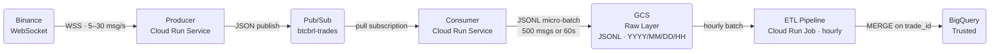
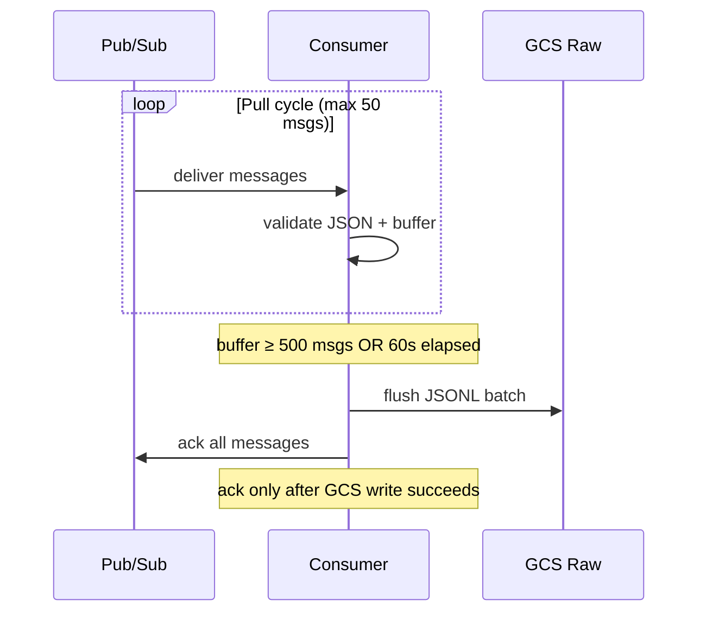

# BTCBRL Real-Time Data Platform

End-to-end streaming data pipeline ingesting live BTC/BRL trade events from Binance into a medallion architecture on GCP. Built for dev, designed to be production-ready.

---

## Architecture



### Medallion Layers

| Layer | Technology | Resource |
|---|---|---|
| Raw | GCS | `btcbrl/raw/YYYY/MM/DD/HH/trades_<ts>.jsonl` |
| Trusted | BigQuery | `trusted.binance_btc_trades` |
| Refined | BigQuery Views | `refined.*` — planned |

### Component responsibilities

| Component | Does | Does not |
|---|---|---|
| Producer | Binance WebSocket → Pub/Sub | no transformation |
| Consumer | Pub/Sub → GCS raw (JSONL) | no transformation, no BigQuery |
| ETL Pipeline | GCS raw → BigQuery Trusted (MERGE) | no Pub/Sub access |

---

## Stack

| Component | Technology | Why |
|---|---|---|
| Streaming ingestion | Python `asyncio` + `websockets` | Single-threaded async I/O handles 5–30 msg/s without thread overhead |
| Message broker | GCP Pub/Sub | Decouples producer from consumer; buffers up to 7 days on failure |
| Raw storage | GCS (JSONL) | Immutable, replayable — single source of truth for backfills and schema evolution |
| Analytical store | BigQuery | Serverless SQL, scales to petabytes, MERGE support |
| ETL batch | Pure Python + BigQuery SDK | No Spark/Dataflow overhead at this volume |
| Infrastructure | Terraform | Reproducible multi-environment deploys |
| Compute | Cloud Run Service + Job | Serverless, pay-per-use, no cluster management |

---

## Key Engineering Decisions

### Why consumer writes only to GCS — not directly to BigQuery

A common pattern is to stream-insert directly into BigQuery from the consumer. We deliberately avoided this for three reasons:

1. **Schema evolution** — if Binance changes their payload, only the ETL needs updating. A consumer writing to BigQuery would couple ingestion to the schema.
2. **Backfills** — GCS is the source of truth. Any historical hour can be reprocessed by re-running the ETL against the raw files, no Pub/Sub replay needed.
3. **Single responsibility** — the consumer's job is reliable delivery to GCS. Transformation, typing, and deduplication belong to the ETL.

The WebSocket is a delivery mechanism imposed by the data provider, not a real-time analytics requirement.

---

### Producer — reliable WebSocket ingestion

**asyncio + `run_in_executor`:** The Pub/Sub client is synchronous (blocking). Wrapping it in `run_in_executor` offloads the blocking call to a thread pool while keeping the asyncio event loop free to receive the next WebSocket message — no message loss during high-frequency bursts.

**Graceful SIGTERM shutdown:** Cloud Run sends SIGTERM before terminating a container. A signal handler sets a stop event; the loop exits cleanly on the next iteration rather than dying mid-publish.

**Self-healing reconnect:** Binance closes WebSocket connections after 24h by design. The reconnect loop is automatic — no human intervention or container restart needed.

---

### Consumer — reliable raw landing



**Ack-after-write:** Messages are acknowledged only after the GCS write succeeds. If GCS fails, Pub/Sub redelivers — no data loss.

**Poison pill handling:** Unparseable messages are immediately acked with an error log. Without this, a single malformed message blocks the consumer indefinitely until Pub/Sub's 7-day retention expires.

**Final flush on shutdown:** On SIGTERM, buffered messages are flushed before the process exits — zero data loss on Cloud Run lifecycle events.

---

### ETL Pipeline — idempotent batch processing

**`trade_id` as primary key, not `event_time`:** Multiple trades can share the same millisecond timestamp. `t` (trade_id) is Binance's own sequential unique identifier — confirmed from production data.

**MERGE over append:** `MERGE ON trade_id` is idempotent — running the ETL for the same hour multiple times always produces the same result. A plain `INSERT` would create duplicates on retries.

**Staging table pattern:** Load new data into a temp staging table → `MERGE` staging into target → drop staging. Keeps the merge atomic without scanning the production table during load.

**String → NUMERIC for prices:** Binance sends prices as strings (`"p": "394285.00000000"`). Converting to Python `float` before loading introduces floating-point rounding. Passing the raw string to BigQuery's JSON loader preserves exact decimal precision.

**Backfill by design:** Set `TARGET_HOUR=2026-05-07T23:00:00` to reprocess any historical hour. No code changes needed.

---

## Infrastructure

Fully managed via Terraform with one GCP project per environment:

```
infra/terraform/
├── main.tf                    # all GCP resources
├── variables.tf
├── outputs.tf
└── environments/
    ├── dev.tfvars             # project: gcp-fin-data
    └── prod.tfvars            # project: gcp-fin-data-prod
```

**Least-privilege service accounts.** Each component has its own service account scoped to exactly what it needs — producer can only publish, consumer can only subscribe and write to GCS, pipeline can only read GCS and write to BigQuery Trusted.

```bash
cd infra/terraform
terraform init
terraform apply -var-file=environments/dev.tfvars
```

---

## Project Structure

```
.
├── cloud-run/
│   ├── producer/              # Binance WebSocket → Pub/Sub
│   │   ├── app.py
│   │   ├── requirements.txt
│   │   └── Dockerfile
│   ├── consumer/              # Pub/Sub → GCS raw (no BigQuery)
│   │   ├── app.py
│   │   ├── requirements.txt
│   │   └── Dockerfile
│   └── pipelines/             # batch ETL jobs (shared Docker image)
│       ├── btcbrl_raw_trusted.py
│       ├── requirements.txt
│       └── Dockerfile
├── infra/
│   └── terraform/
├── technical_document.md      # design rationale (PT-BR)
└── README.md
```

---

## Running Locally

```bash
python -m venv .venv && source .venv/bin/activate

# Producer
pip install -r cloud-run/producer/requirements.txt
python cloud-run/producer/app.py

# Consumer
pip install -r cloud-run/consumer/requirements.txt
python cloud-run/consumer/app.py

# ETL — previous hour
pip install -r cloud-run/pipelines/requirements.txt
python cloud-run/pipelines/btcbrl_raw_trusted.py

# ETL — specific hour backfill
TARGET_HOUR=2026-05-07T23:00:00 python cloud-run/pipelines/btcbrl_raw_trusted.py
```

Credentials: `gcloud auth application-default login` — no service account key files.

---

## Tradeoffs & What Would Change at Scale

| Decision | Works now | Changes at scale |
|---|---|---|
| Synchronous Pub/Sub pull | Simple, controllable batching | Switch to streaming pull with flow control |
| Pure Python ETL | No Spark overhead for ~10k trades/hour | Dataflow if volume grows 100× |
| Hourly ETL trigger | Clean boundaries, easy backfill | Sub-hour partitioning if latency SLA tightens |
| Local Terraform state | Fine for solo dev | GCS backend with state locking for team |
| No dead-letter queue | Poison pills logged and acked | Add DLQ subscription for malformed message audit trail |
